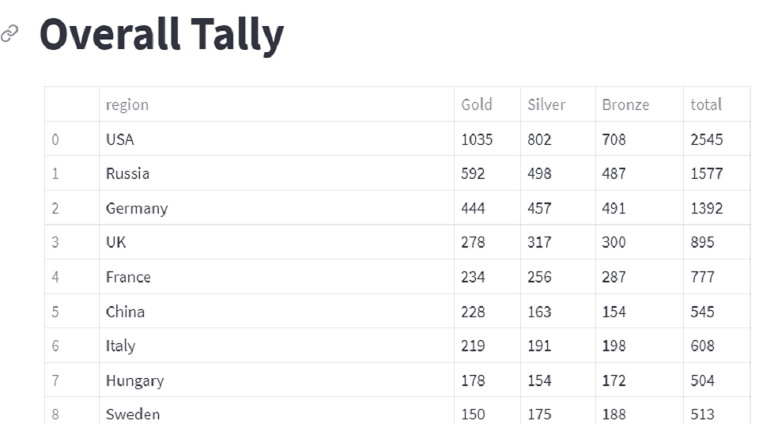
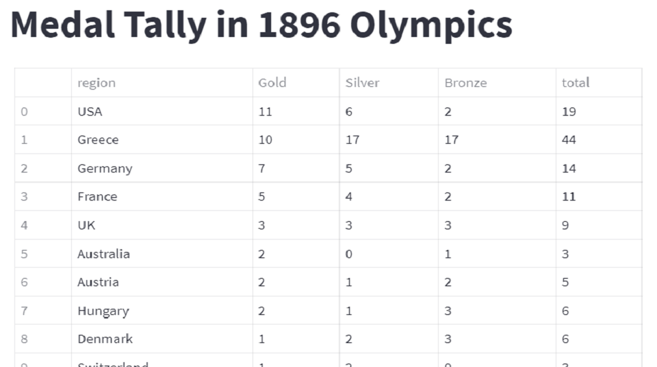
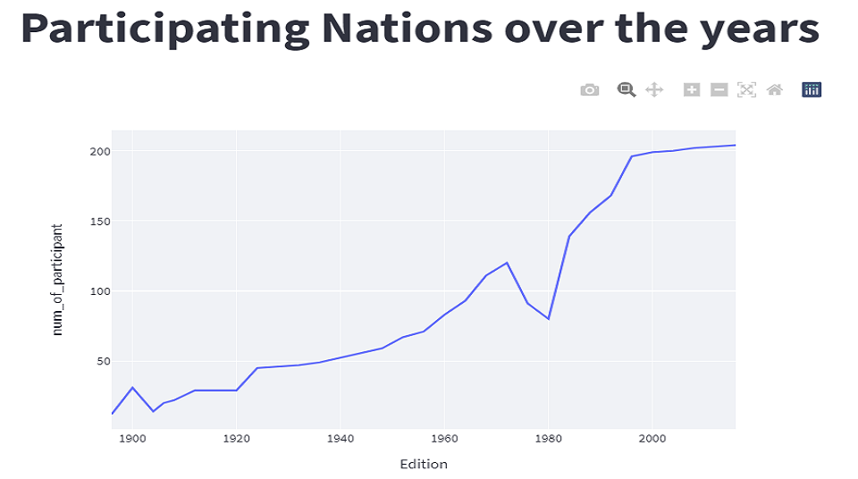
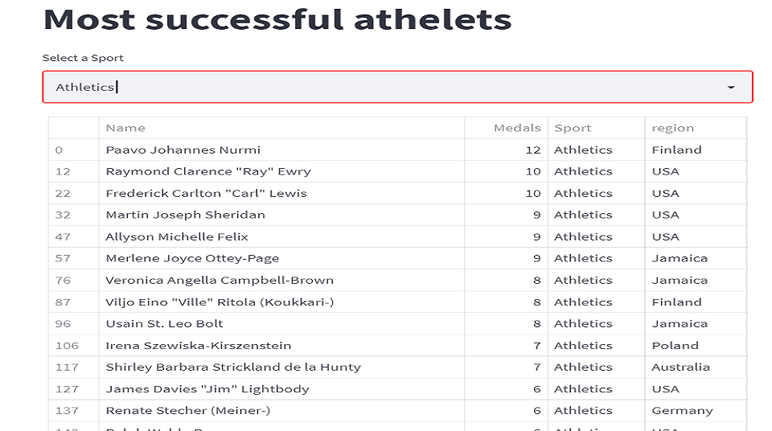
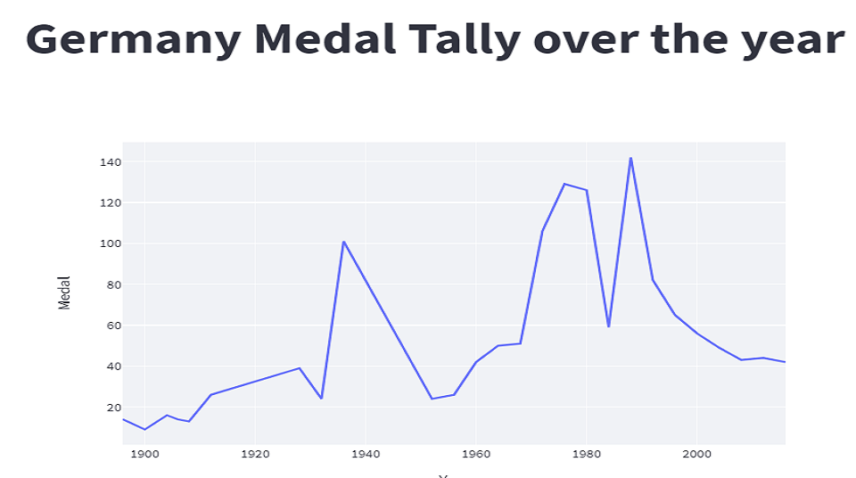
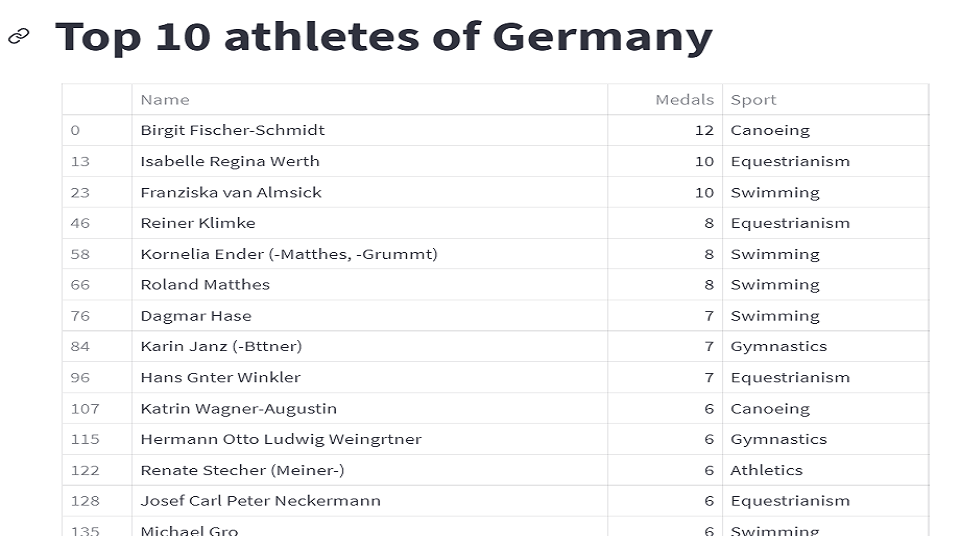
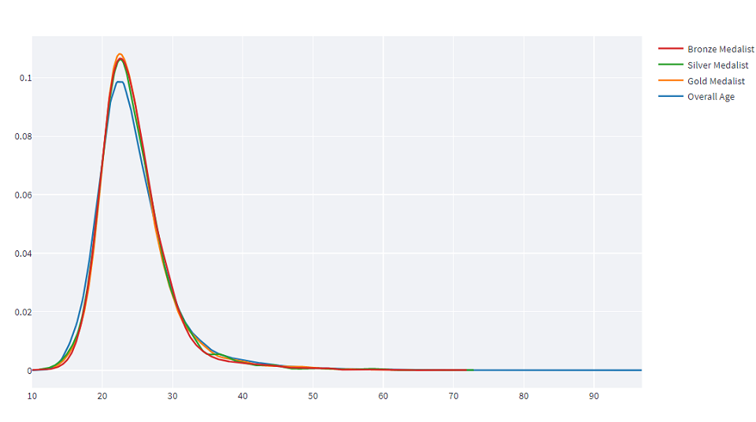
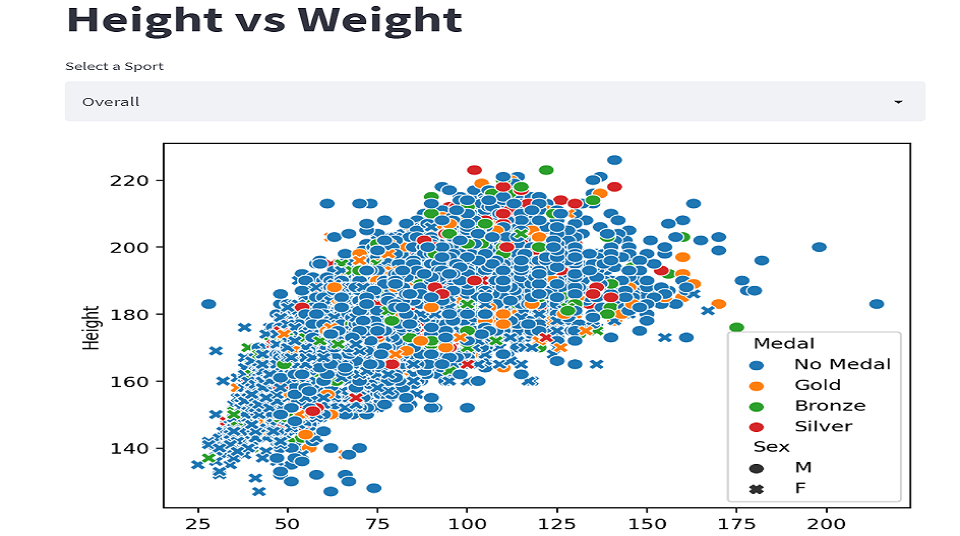

# olympics_analysis
I tried to analysis Olympics events dataset over the year.

## About

In this project I tried to analysis Olympics dataset from Kaggle. The objective of the project is finding the different kind of statistics about Olympics. This project is divided into four parts i) Medal Tally, ii) Overall analysis, iii) Country-wise analysis and iv) Athletes-wise analysis. To properly visualize I used streamlit library.

## Usage
- Install streamlit 
- Clone the directory 
- In the directory run your shell and type 'streamlit run app.py

## Overview of the Analysis
Some hightlights and images are included below. 

The <strong>Medal Tally</strong> section represent a table of country and coressponing medals. But its also possible ot filter medal tally based country and event year.

   
   

In <strong>Overall Analysis</strong> section, I have presented total statistics like number of editions, total participated athletes, countries etc. There is a heatmap of events per edition, a line graph of events over the years and  a table of successful athletes which is filterable based on types sports categories. 

  
   

<strong>Country-wise Analysis</strong> section able to filter by country name and shows that particular countries number of medals over the year, a heat map over medals and a top 10 athletes list.

  
   

In this last section <strong>Athletes-wise Analysis,</strong> I tried represent a line graph of <i>distribute of age</i> of winning medals, heigh vs weight medal winning ration in different sports.

  
   
There are few others things are also analyzed and presented in the app but my heartful appreciation for visiting this repo.
